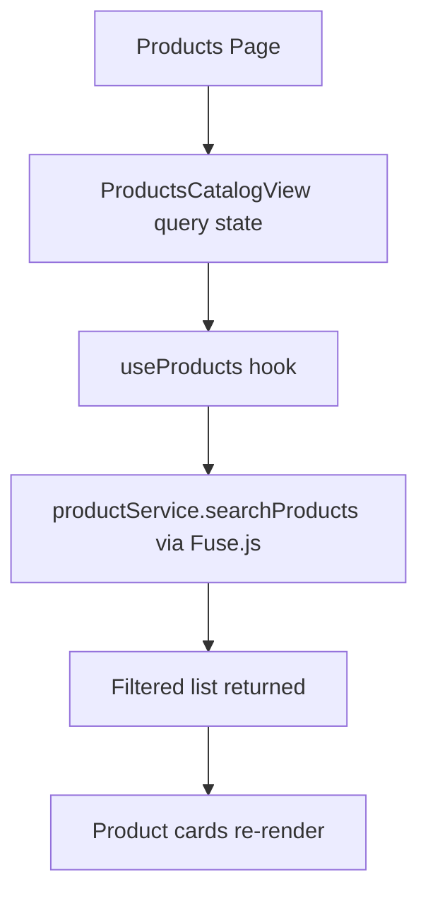
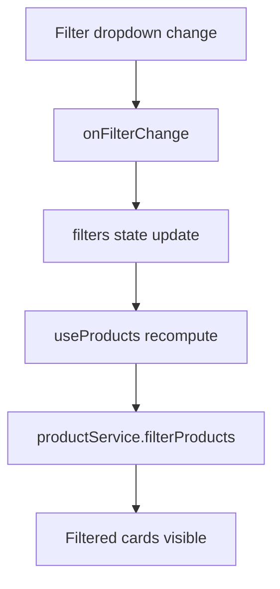
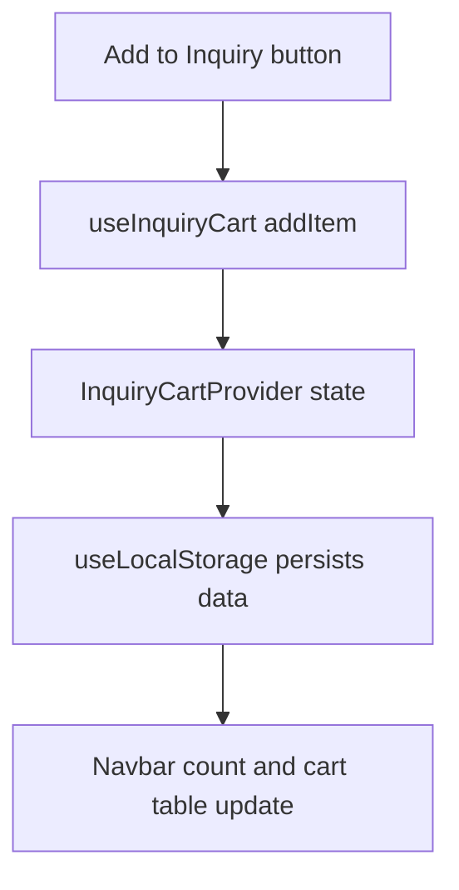
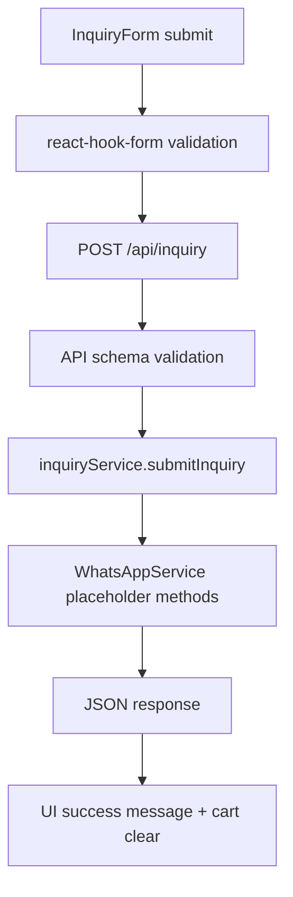
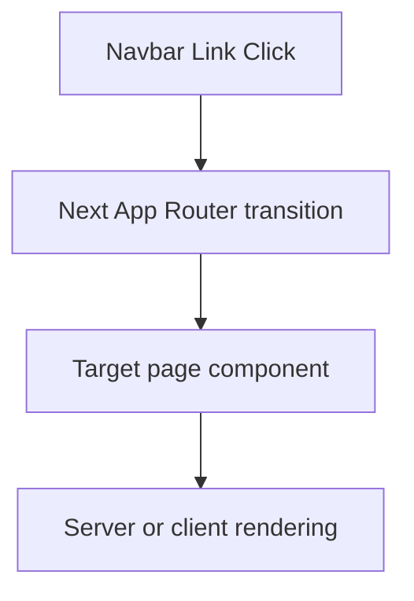
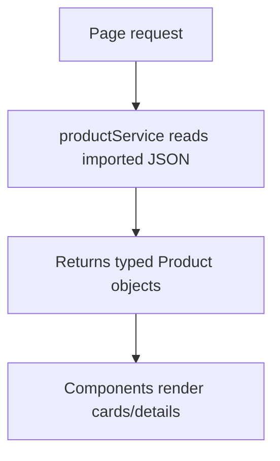

# 09 Code Tracing Guide

## How to Trace Any Flow
Use this model:
1. Page entry
2. Component event
3. Hook or context state update
4. Service call
5. API request/response (if applicable)
6. UI re-render

## Search Flow


## Filter Flow


## Cart Flow


## Inquiry Submit Flow


## Navigation and Routing Flow


## Product Loading Flow


## Product Details Flow
```mermaid
flowchart TD
  A[/products/[slug]] --> B[get slug param]
  B --> C[productService.getProductBySlug]
  C --> D[Render detail sections]
  D --> E[AddToInquiryButton interaction]
```
